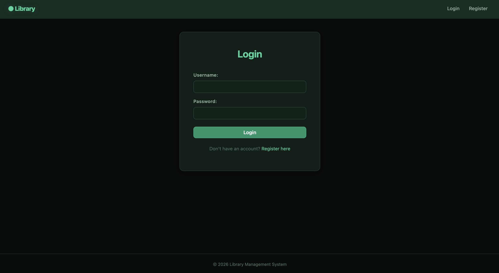
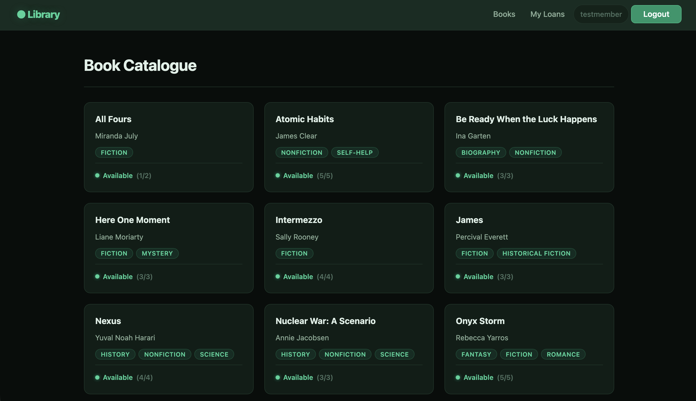
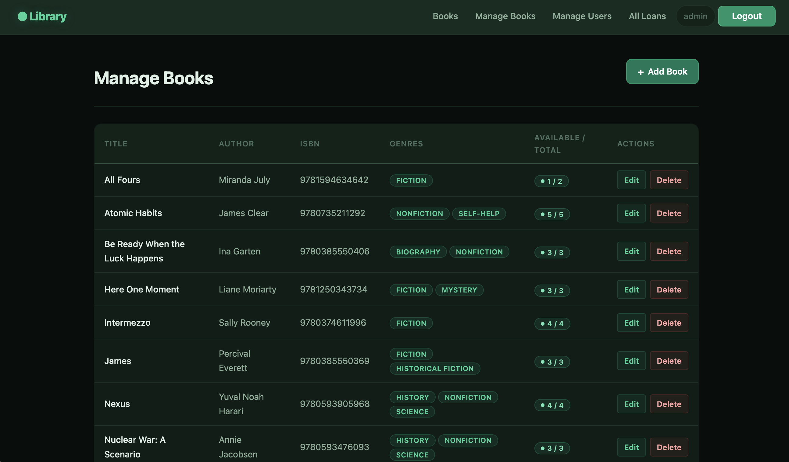

# Library Management System

A full-stack web application for managing a library's book inventory and lending operations. Members can browse the catalogue, check out books, and track their loans, while staff (librarians) have full control over inventory, loans, and user management.

Built as coursework for the Distributed Systems and Cloud Computing (DSCC) module by 00019257.

---

## Architecture Overview

The application follows a layered architecture deployed as a multi-container Docker Compose stack on a single VPS. Only the Nginx reverse proxy is exposed to the public internet; all other services communicate over an isolated Docker bridge network.

```
                        ┌──────────────────────────────────────────────┐
                        │                   VPS                        │
                        │                                              │
  Client ──── HTTPS ──▶ │  ┌───────────────────┐                      │
              (443)      │  │  Nginx (Alpine)    │                      │
                        │  │  TLS termination   │                      │
  Client ──── HTTP ───▶ │  │  static files      │                      │
              (80)       │  │  HTTP→HTTPS redir  │                      │
                        │  └────────┬───────────┘                      │
                        │           │ proxy_pass :8000                  │
                        │           ▼                                   │
                        │  ┌───────────────────┐                       │
                        │  │  Gunicorn + Django │                       │
                        │  │  (Python 3.12)     │                       │
                        │  │  no exposed ports  │                       │
                        │  └────────┬───────────┘                      │
                        │           │ psycopg2                          │
                        │           ▼                                   │
                        │  ┌───────────────────┐                       │
                        │  │  PostgreSQL 16     │                       │
                        │  │  persistent volume │                       │
                        │  └───────────────────┘                       │
                        │                                              │
                        │  ── backend (bridge network) ──              │
                        └──────────────────────────────────────────────┘
```

**Key design decisions:**
- **Network isolation** — Only Nginx binds host ports (80/443). The Django application server and database are unreachable from outside the Docker network.
- **TLS termination at the edge** — Nginx handles HTTPS with Let's Encrypt certificates; Django receives plain HTTP internally and trusts the `X-Forwarded-Proto` header.
- **Stateless application container** — Static files are collected into a shared Docker volume served directly by Nginx, keeping the application server focused on dynamic requests.

---

## Features

**Member (regular user):**
- Browse the book catalogue with availability indicators
- View detailed book information
- Check out available books
- Return checked-out books
- View personal loan history (active and returned)
- Self-service registration

**Staff / Librarian (`is_staff`):**
- Full CRUD management of the book catalogue (add, edit, delete)
- View and filter all loans (all / active / returned)
- Assign loans on behalf of members
- Force-return any active loan
- View all registered members with active loan counts
- Django admin panel access

**Platform:**
- Role-based access control with server-side permission enforcement
- Atomic database operations for checkout/return (prevents race conditions)
- Unique constraint preventing duplicate active loans
- CSRF protection on all forms
- Production-hardened security headers (HSTS, secure cookies)
- Responsive dark emerald UI theme
- 54 automated tests covering auth, books, loans, forms, staff operations, and permissions

---

## Technologies Used

| Layer | Technology |
|---|---|
| Backend | Python 3.12, Django 6.0.2 |
| Database | PostgreSQL 16 |
| Application Server | Gunicorn |
| Reverse Proxy / TLS | Nginx (Alpine) |
| TLS Certificates | Let's Encrypt via Certbot |
| Containerisation | Docker (multi-stage build), Docker Compose |
| CI/CD | GitHub Actions |
| Testing | pytest, pytest-django |
| Linting | flake8 |

---

## CI/CD Pipeline

The project uses a GitHub Actions workflow (`.github/workflows/test.yml`) with two jobs triggered on every push or pull request to `main`.

### Job 1 — Test

Runs on every push and pull request:

1. Spins up a **PostgreSQL 16** service container
2. Sets up **Python 3.12** and installs dev dependencies
3. Runs **flake8** linting (max line length 119, excludes migrations)
4. Runs **database migrations** against the test database
5. Runs the full **pytest** suite (54 tests)

### Job 2 — Deploy

Runs only on push to `main`, after the test job passes:

1. **Builds** a Docker image from the multi-stage `Dockerfile`
2. **Pushes** the image to DockerHub (tagged `latest` + commit SHA)
3. **SSHs into the VPS** using `appleboy/ssh-action`
4. Pulls the latest code with `git pull origin main`
5. Rebuilds and restarts the `web` container (`docker compose up -d --no-deps --build web`)
6. Runs database migrations inside the new container

This provides a fully automated pipeline: code pushed to `main` is linted, tested, containerised, pushed to a registry, and deployed to production — with zero manual intervention.

---

## Security

Security is enforced across multiple layers of the stack:

**Application layer:**
- **Role-based access control** — `StaffRequiredMixin` combines `LoginRequiredMixin` with a `UserPassesTestMixin` check for `is_staff`, protecting all staff-only views
- **POST-only state changes** — Checkout, return, and force-return views reject GET requests with HTTP 405, preventing CSRF via link injection
- **Cross-user isolation** — Member views scope queries to the authenticated user; a member cannot return another member's loan
- **CSRF protection** — Django's CSRF middleware is active on all forms
- **Atomic transactions** — `select_for_update()` locks book rows during checkout/return to prevent race conditions on `available_copies`
- **Database constraints** — A `CheckConstraint` ensures `available_copies >= 0`; a `UniqueConstraint` prevents duplicate active loans for the same member and book

**Infrastructure layer:**
- **Non-root Docker user** — The application runs as a dedicated `app` system user inside the container
- **Network isolation** — Only Nginx is exposed to the internet; Django and PostgreSQL are on an internal bridge network
- **Multi-stage Docker build** — Build tools (gcc, libpq-dev) are discarded in the runtime image, reducing the attack surface
- **TLS with HSTS** — Let's Encrypt certificates with HSTS enabled (1 year, includeSubDomains, preload)
- **Secure cookies** — `SESSION_COOKIE_SECURE` and `CSRF_COOKIE_SECURE` are enabled in production, preventing transmission over plain HTTP
- **Content-type sniffing protection** — `SECURE_CONTENT_TYPE_NOSNIFF` is enabled in production

---

## Testing Overview

The test suite consists of **54 tests** across 6 modules, using **pytest-django** with shared fixtures defined in `conftest.py` (member user, staff user, book, genre, active loan).

| Module | Tests | What it covers |
|---|---|---|
| `test_auth.py` | 4 | User registration (valid, duplicate, mismatch), login |
| `test_books.py` | 6 | Book catalogue listing, detail views, availability display |
| `test_loans.py` | 8 | Checkout flow, return flow, my-loans page, edge cases |
| `test_forms.py` | 6 | `BookForm` and `AssignLoanForm` validation (valid/invalid data) |
| `test_staff.py` | 11 | Staff CRUD, loan assignment, force-return, loan filtering |
| `test_permissions.py` | 19 | Staff-only access, anonymous redirects, POST-only enforcement, cross-user isolation |

Tests run against a real PostgreSQL 16 instance (both locally via Docker Compose and in CI via GitHub Actions service containers), ensuring behaviour matches the production database engine.

```bash
# Run the full suite locally
docker compose -f docker-compose.dev.yml exec web pytest -v
```

---

## Local Setup Instructions

### Prerequisites

- [Docker](https://docs.docker.com/get-docker/) and [Docker Compose](https://docs.docker.com/compose/install/) installed
- Git

### Steps

1. **Clone the repository:**
   ```bash
   git clone https://github.com/malikahon/library_checkout.git
   cd library_checkout
   ```

2. **Create a `.env` file** in the project root (or use the provided example):
   ```dotenv
   SECRET_KEY=your-dev-secret-key
   DEBUG=True
   ALLOWED_HOSTS=localhost,127.0.0.1

   DB_NAME=library_db
   DB_USER=library_user
   DB_PASSWORD=library_pass
   DB_HOST=localhost
   DB_PORT=5433
   ```

3. **Start the development stack:**
   ```bash
   docker compose -f docker-compose.dev.yml up --build
   ```
   This starts PostgreSQL and Django's development server with live code reloading.

4. **Access the application** at [http://localhost:8000](http://localhost:8000).

5. **(Optional) Seed sample data:**
   ```bash
   docker compose -f docker-compose.dev.yml exec web python manage.py populate_books
   ```

6. **(Optional) Create a superuser:**
   ```bash
   docker compose -f docker-compose.dev.yml exec web python manage.py createsuperuser
   ```

---

## Deployment Instructions (VPS with Docker Compose)

### Prerequisites

- A VPS (e.g., Ubuntu 22.04+) with Docker installed
- A registered domain with a DNS A record pointing to the server IP
- Ports 80 and 443 open on the firewall

### Steps

1. **SSH into the server and clone the repository:**
   ```bash
   git clone https://github.com/malikahon/library_checkout.git
   cd library_checkout
   ```

2. **Create a production `.env.docker` file:**
   ```dotenv
   SECRET_KEY=<generate-a-strong-random-key>
   DEBUG=False
   ALLOWED_HOSTS=managelibrary.app,www.managelibrary.app,20.24.83.116

   DB_NAME=library_db
   DB_USER=library_user
   DB_PASSWORD=<strong-random-password>
   DB_HOST=db
   DB_PORT=5432

   POSTGRES_DB=library_db
   POSTGRES_USER=library_user
   POSTGRES_PASSWORD=<strong-random-password>
   ```

3. **Update `nginx/nginx.conf`** — replace all occurrences of `managelibrary.app` with your actual domain (already done if using this repo).

4. **Obtain an SSL certificate and start the stack:**
   ```bash
   bash init-ssl.sh
   ```
   This script installs Certbot on the host (via snap), obtains a Let's Encrypt certificate in standalone mode for the configured domain, sets up an auto-renewal hook that reloads Nginx, and starts the full Docker Compose stack.

5. **Create a superuser:**
   ```bash
   docker compose exec web python manage.py createsuperuser
   ```
   > **Note:** Database migrations run automatically on container startup via `entrypoint.sh`, so there is no need to run them manually.

6. **(Optional) Seed sample data:**
   ```bash
   docker compose exec web python manage.py populate_books
   ```

7. **Verify** — visit `https://managelibrary.app` in a browser.

### Manual Start (without init-ssl.sh)

If SSL certificates already exist at `/etc/letsencrypt/`, start the stack directly:

```bash
docker compose up -d --build
```

This starts three services: PostgreSQL, Django/Gunicorn, and Nginx.

### Zero-Downtime Redeployment

```bash
docker compose pull
docker compose up -d --build
docker compose exec web python manage.py migrate --noinput
```

---

## Environment Variables

All configuration is managed through environment variables. No secrets are hardcoded.

| Variable | Required | Default | Description |
|---|---|---|---|
| `SECRET_KEY` | Yes | — | Django cryptographic signing key. The app raises `ImproperlyConfigured` if missing. |
| `DEBUG` | No | `False` | Set to `True` for local development only. |
| `ALLOWED_HOSTS` | No | *(empty)* | Comma-separated list of valid hostnames. Must be set for the app to accept requests. |
| `DB_NAME` | Yes | — | PostgreSQL database name. Supplied via `.env` / `.env.docker`. |
| `DB_USER` | Yes | — | PostgreSQL username. Supplied via `.env` / `.env.docker`. |
| `DB_PASSWORD` | Yes | — | PostgreSQL password. Use a strong password in production. |
| `DB_HOST` | No | `localhost` | Database host. Set to `db` when using Docker Compose. |
| `DB_PORT` | No | `5433` | Database port. Use `5432` inside Docker networks. |
| `WEB_CONCURRENCY` | No | `3` | Number of Gunicorn worker processes. |
| `POSTGRES_DB` | No* | — | PostgreSQL container init: database name (must match `DB_NAME`). |
| `POSTGRES_USER` | No* | — | PostgreSQL container init: username (must match `DB_USER`). |
| `POSTGRES_PASSWORD` | No* | — | PostgreSQL container init: password (must match `DB_PASSWORD`). |

\* Required in `.env.docker` for the PostgreSQL Docker container's first-run initialisation.

---

## Screenshots

### Login Page


### Book Catalogue (Member View)


### Manage Books (Staff View)


---

## Project Structure

```
library_checkout/
├── config/              # Django project settings, URLs, WSGI/ASGI
├── library/             # Main app: models, views, forms, admin, management commands
├── templates/           # HTML templates (base, registration, library, staff, error pages)
├── static/              # Static assets (CSS, images, JS)
├── tests/               # pytest-django test suite (54 tests across 6 modules)
├── nginx/               # Nginx reverse proxy configuration
├── .github/workflows/   # CI/CD pipeline (GitHub Actions)
├── Dockerfile           # Multi-stage Docker build (non-root user)
├── docker-compose.yml   # Production: Postgres + Gunicorn + Nginx
├── docker-compose.dev.yml  # Development: Postgres + Django dev server
├── entrypoint.sh        # Container entrypoint (collectstatic, migrate, gunicorn)
├── init-ssl.sh          # One-shot SSL setup (Certbot + stack bootstrap)
├── requirements.txt     # Production Python dependencies
└── requirements-dev.txt # Development dependencies (adds pytest, flake8)
```
